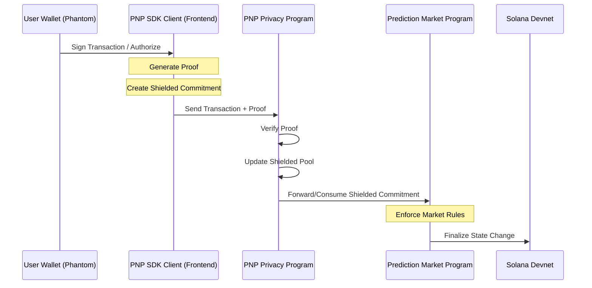

## Arch

```mermaid
sequenceDiagram
    participant User as User Wallet (Phantom)
    participant SDK as PNP SDK Client (Frontend)
    participant Privacy as PNP Privacy Program
    participant Market as Prediction Market Program
    participant Devnet as Solana Devnet

    User->>SDK: Sign Transaction / Authorize

    Note over SDK: Generate Proof
    Note over SDK: Create Shielded Commitment

    SDK->>Privacy: Send Transaction + Proof

    Privacy->>Privacy: Verify Proof
    Privacy->>Privacy: Update Shielded Pool

    Privacy->>Market: Forward/Consume Shielded Commitment

    Note over Market: Enforce Market Rules

    Market->>Devnet: Finalize State Change
```
